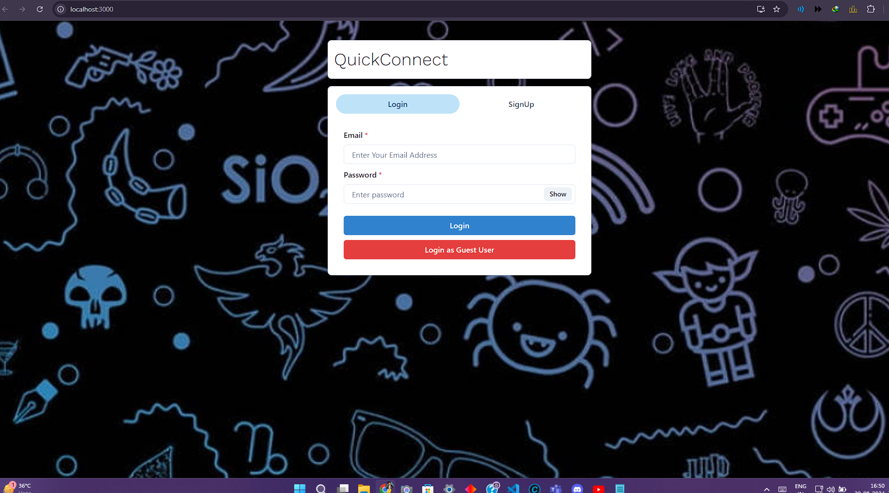
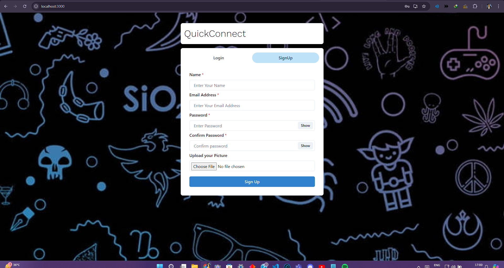
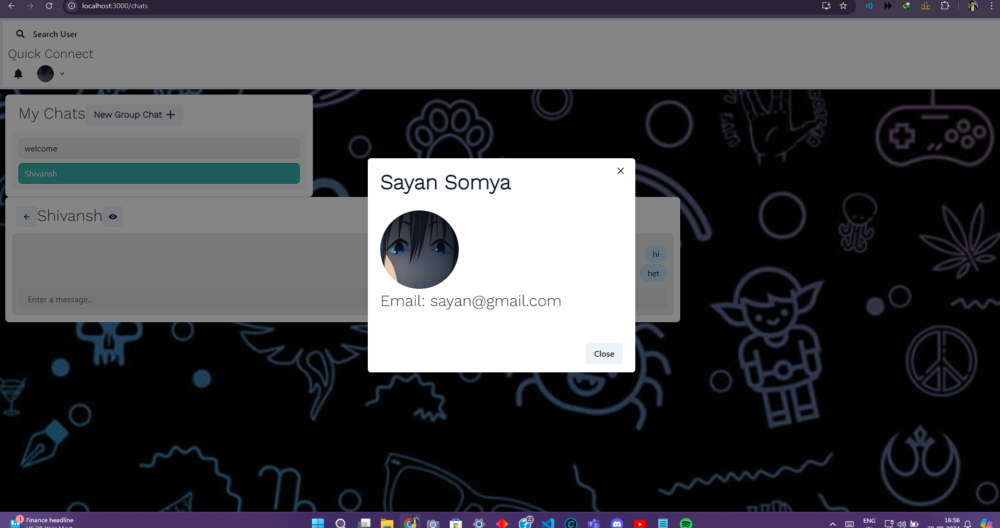
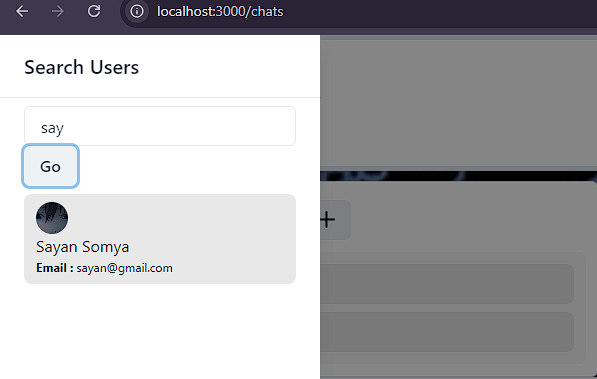

# QuickConnect 🚀

QuickConnect is a real-time web chat application designed to facilitate seamless communication between users. Built with modern web technologies, this project demonstrates real-time data handling, and user interface design.

## Features ✨

- **Real-Time Messaging**: Users can send and receive messages instantly. 💬
- **User Authentication**: Secure login and registration system. 🔒
- **Responsive Design**: Optimized for both desktop and mobile devices. 📱💻
- **Notification System**: Real-time notifications for incoming messages. 🔔
- **Chat History**: Persistent chat history for user convenience. 🗂️

## Technologies Used 🛠️

- **Frontend**:
  - React ⚛️
  - Redux 🔄
  - Socket.io-client 🌐
  - CSS 🎨
- **Backend**:
  - Node.js 🚀
  - Express.js ⚡️
  - Socket.io 🌐
  - MongoDB 🗃️

## Installation 🏠

To run QuickConnect locally, follow these steps:

1. **Clone the repository:**

    ```bash
    git clone https://github.com/SayanSomya/quickconnect.git
    ```

2. **Navigate to the project directory:**

    ```bash
    cd QuickConnect
    ```

3. **Install the dependencies:**

    For the backend:

    ```bash
    npm install
    ```

   For the frontend:

    ```bash
    cd frontend
    npm install
    ```

4. **Start the backend server:**

    ```bash
    npm start
    ```

5. **Start the frontend development server:**

    ```bash
    cd frontend
    npm start
    ```

6. **Open your browser and navigate to `http://localhost:3000` to see the app in action.** 🌐

## Usage 📝

- **Sign Up / Log In**: Create an account or log in to access the chat features. 🆔
- **Start a Chat**: Click on a user's name to start a new conversation. 💬
- **Send Messages**: Type your message and hit enter to send. 🚀
- **Notifications**: You'll receive real-time notifications for new messages. 🔔

---

## Screenshots 📸 

1. **Login Screen**  
   

2. **SignUp Screen**  
   

3. **Chat Screen**  
   

4. **Search User**  
   
